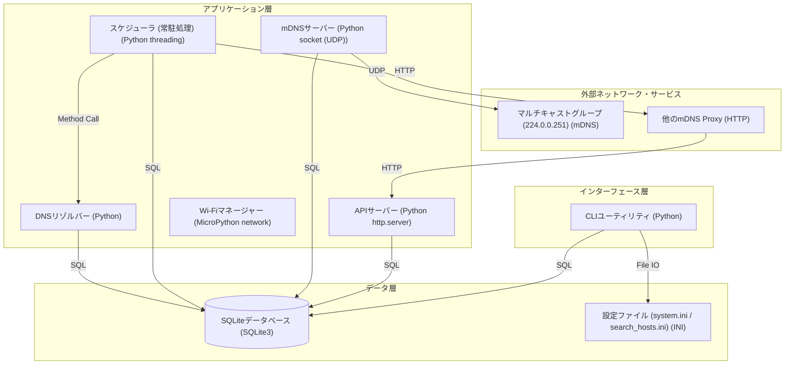

# アーキテクチャ構成図

常駐処理として動作し、mDNSサーバー機能とレコード同期機能を提供するプロキシシステム。

**インターフェース層:**
- CLIユーティリティ [Python]

**アプリケーション層:**
- APIサーバー [Python http.server]
- mDNSサーバー [Python socket (UDP)]
- スケジューラ (常駐処理) [Python threading]
- DNSリゾルバー [Python]
- Wi-Fiマネージャー [MicroPython network]

**データ層:**
- SQLiteデータベース [SQLite3]
- 設定ファイル (system.ini / search_hosts.ini) [INI]

**外部ネットワーク・サービス:**
- マルチキャストグループ (224.0.0.251) [mDNS]
- 他のmDNS Proxy [HTTP]

**接続:**
- CLIユーティリティ → SQLiteデータベース (SQL)
- CLIユーティリティ → 設定ファイル (system.ini / search_hosts.ini) (File IO)
- APIサーバー → SQLiteデータベース (SQL)
- mDNSサーバー → SQLiteデータベース (SQL)
- mDNSサーバー → マルチキャストグループ (224.0.0.251) (UDP)
- スケジューラ (常駐処理) → SQLiteデータベース (SQL)
- スケジューラ (常駐処理) → DNSリゾルバー (Method Call)
- スケジューラ (常駐処理) → 他のmDNS Proxy (HTTP)
- DNSリゾルバー → SQLiteデータベース (SQL)
- 他のmDNS Proxy → APIサーバー (HTTP)

