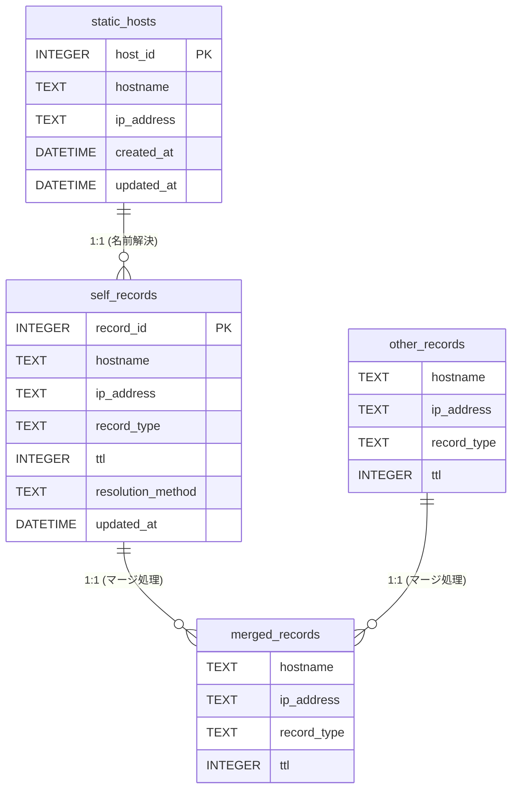

# ER図

mDNS Proxyのデータベース設計。静的ホスト(static_hosts)から名前解決によって自己レコード(self_records)が生成され、他ノードから同期されたレコード(other_records)と共にマージ処理が行われてマージ済みレコード(merged_records)が構成されるデータの流れと論理的関係を示しています。

### エンティティ一覧

**static_hosts**

| カラム名 | データ型 | キー |
| --- | --- | --- |
| host_id | INTEGER | PK |
| hostname | TEXT |  |
| ip_address | TEXT |  |
| created_at | DATETIME |  |
| updated_at | DATETIME |  |

**self_records**

| カラム名 | データ型 | キー |
| --- | --- | --- |
| record_id | INTEGER | PK |
| hostname | TEXT |  |
| ip_address | TEXT |  |
| record_type | TEXT |  |
| ttl | INTEGER |  |
| resolution_method | TEXT |  |
| updated_at | DATETIME |  |

**other_records**

| カラム名 | データ型 | キー |
| --- | --- | --- |
| hostname | TEXT |  |
| ip_address | TEXT |  |
| record_type | TEXT |  |
| ttl | INTEGER |  |

**merged_records**

| カラム名 | データ型 | キー |
| --- | --- | --- |
| hostname | TEXT |  |
| ip_address | TEXT |  |
| record_type | TEXT |  |
| ttl | INTEGER |  |

### リレーション

- static_hosts → self_records (1:1 (名前解決))
- self_records → merged_records (1:1 (マージ処理))
- other_records → merged_records (1:1 (マージ処理))

### ER図

