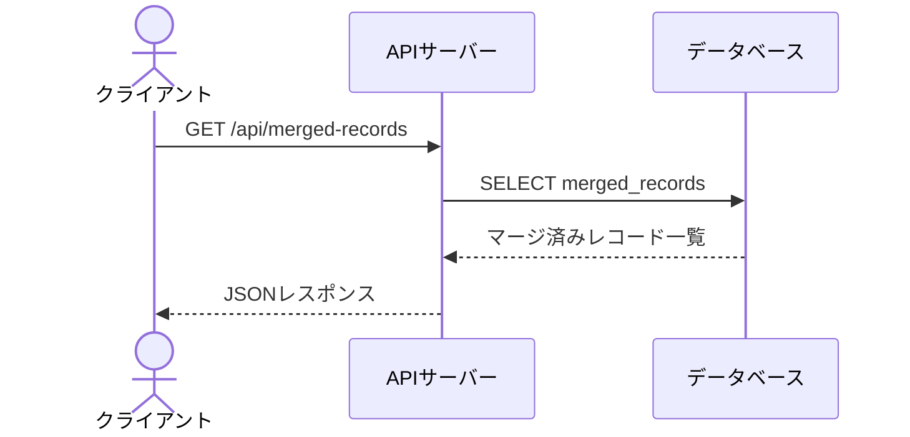
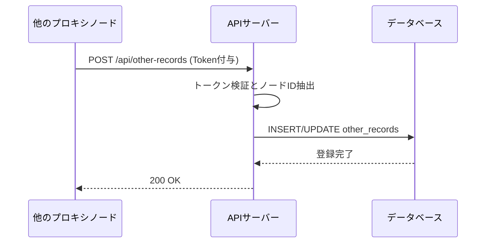
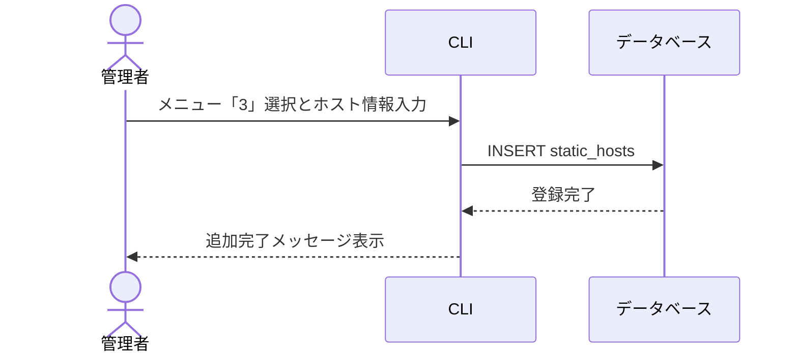
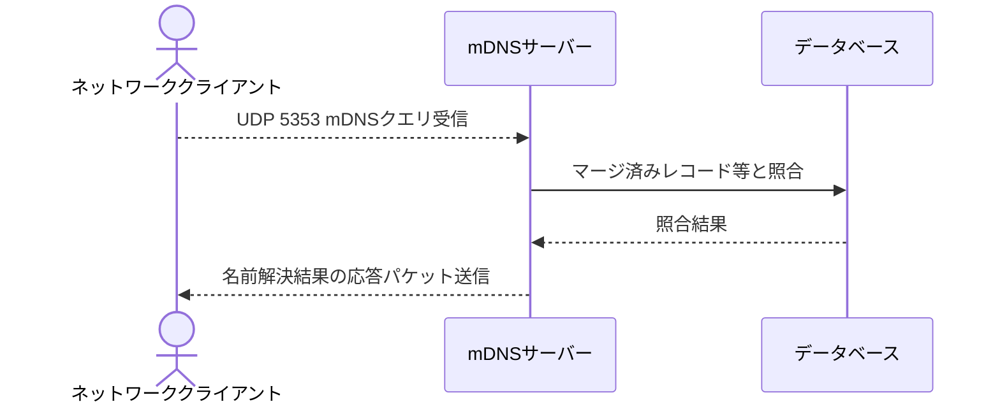
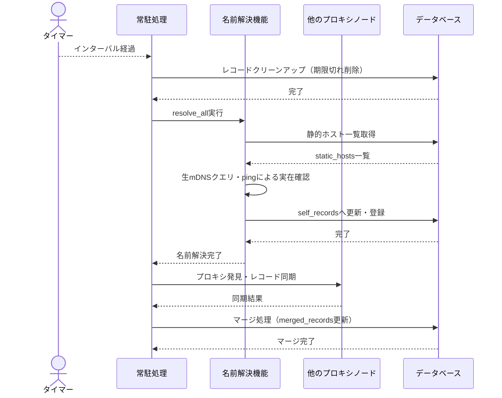

# シーケンス図

## API機能

外部クライアントからの要求に応じ、マージ済みレコード一覧をJSONで返却する

**参加者:** クライアント (actor)、APIサーバー (system)、データベース (database)

**メッセージフロー:**
- クライアント → APIサーバー: GET /api/merged-records
- APIサーバー → データベース: SELECT merged_records
  - データベース ← APIサーバー: マージ済みレコード一覧
  - APIサーバー ← クライアント: JSONレスポンス

## API機能

他ノードから送信されるレコードを受信し、other_recordsに登録・更新する

**参加者:** 他のプロキシノード (system)、APIサーバー (system)、データベース (database)

**メッセージフロー:**
- 他のプロキシノード → APIサーバー: POST /api/other-records (Token付与)
- APIサーバー → APIサーバー: トークン検証とノードID抽出
- APIサーバー → データベース: INSERT/UPDATE other_records
  - データベース ← APIサーバー: 登録完了
  - APIサーバー ← 他のプロキシノード: 200 OK

## CLI機能

CLIを通じて静的ホストを登録する

**参加者:** 管理者 (actor)、CLI (system)、データベース (database)

**メッセージフロー:**
- 管理者 → CLI: メニュー「3」選択とホスト情報入力
- CLI → データベース: INSERT static_hosts
  - データベース ← CLI: 登録完了
  - CLI ← 管理者: 追加完了メッセージ表示

## コア機能

ネットワーク上のmDNSクエリを受信し、該当するレコードがあれば応答する

**参加者:** ネットワーククライアント (actor)、mDNSサーバー (system)、データベース (database)

**メッセージフロー:**
- ネットワーククライアント → mDNSサーバー: UDP 5353 mDNSクエリ受信
- mDNSサーバー → データベース: マージ済みレコード等と照合
  - データベース ← mDNSサーバー: 照合結果
- mDNSサーバー → ネットワーククライアント: 名前解決結果の応答パケット送信

## バッチ機能

一定間隔でクリーンアップ、名前解決、プロキシ発見、レコード同期、マージ処理を実行する

**参加者:** タイマー (actor)、常駐処理 (system)、名前解決機能 (system)、他のプロキシノード (system)、データベース (database)

**メッセージフロー:**
- タイマー → 常駐処理: インターバル経過
- 常駐処理 → データベース: レコードクリーンアップ（期限切れ削除）
  - データベース ← 常駐処理: 完了
- 常駐処理 → 名前解決機能: resolve_all実行
- 名前解決機能 → データベース: 静的ホスト一覧取得
  - データベース ← 名前解決機能: static_hosts一覧
- 名前解決機能 → 名前解決機能: 生mDNSクエリ・pingによる実在確認
- 名前解決機能 → データベース: self_recordsへ更新・登録
  - データベース ← 名前解決機能: 完了
  - 名前解決機能 ← 常駐処理: 名前解決完了
- 常駐処理 → 他のプロキシノード: プロキシ発見・レコード同期
  - 他のプロキシノード ← 常駐処理: 同期結果
- 常駐処理 → データベース: マージ処理（merged_records更新）
  - データベース ← 常駐処理: マージ完了

